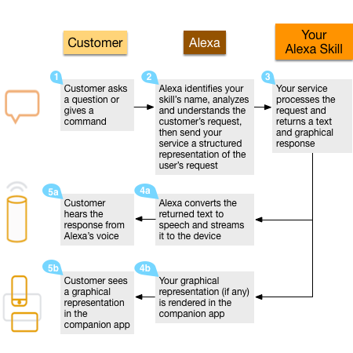

# Custom Skills

## Components of a Custom Skill

- A set of `Intents`: intents represent the core functionality for your skill. Intents can optionally have arguments called `slots`.
- A set of `Sample Utterances`: specify the words and phrases users can say to invoke those intents. Map the intents to the words and phrases users can say to interact with your skill.
- An `invocation name` that identifies the skill. The user includes this name when initiating a conversation with your skill.
- A dialog model identifies information your skill requires and the prompts Alexa can use to collect and confirm that information in a conversation with the user.
- If applicable, a set of images, audio files, and video files that you want to include in the skill. These must be stored on a publicly accessible site so that each item is accessible by a unique URL.
- A `cloud-based service` that accepts these intents as structured requests and then acts upon them. This service must be accessible over the Internet. You provide an endpoint for your service when configuring the skill.
  - Request: IntentRequest
  - Response: with the text to speak to the user.
- A configuration that brings all of the above together so that Alexa can route requests to the service for your skill. You create this configuration in the developer console.

## Examples

- Intent: OneshotTideIntent
- Sample utterances:

```
OneshotTideIntent get high tide
OneshotTideIntent get high tide for {City}
OneshotTideIntent tide information for {City}
OneshotTideIntent when is high tide in {City}
...
(many more sample utterances)
```

- Invocation name: Tide Pooler

> User: Alexa, get high tide for Seattle from Tide Pooler

## Speaking this to an Alexa-enabled device does the following:

- The user's speech is streamed to the Alexa service in the cloud.
- Alexa recognizes that this request represents the OneshotTideIntent intent for the "Tide Pooler" skill.
- Alexa structures this information into a request (specifically an IntentRequest in this example) and sends this request to the service defined for Tide Pooler. The request includes the value "seattle" as the "City".
- The Tide Pooler service gets the request and takes an appropriate action (looking up tide information for the current date in Seattle from http://tidesandcurrents.noaa.gov/).
- Tide Pooler sends the Alexa service a structured response with the text to speak to the user.
- The Alexa-enabled device speaks the response back to the user:

> Tide Pooler: Today in Seattle, the first high tide will be around 1:42 in the morning, and will peak at about 10 feet…



## back-and-forth conversation with the user

If your skill needs more information to complete a request, you can have a back-and-forth conversation with the user:

```
User: Alexa, get high tide from Tide Pooler (Although 'get high tide' maps to the OneShotTideIntent, the user didn't specify the city. Tide Pooler needs to collect this information to continue.)
Tide Pooler: Tide information for what city? (Alexa is now listening for the user's response. For a device with a light ring, like an Amazon Echo, the device lights up to give a visual cue)
User: Seattle
Tide Pooler: Today in Seattle, the first high tide will be at…
Interaction ends.
```

## [Understand How Users Invoke Custom Skills](https://developer.amazon.com/en-US/docs/alexa/custom-skills/understanding-how-users-invoke-custom-skills.html)

## [Steps to Build a Custom Skill](https://developer.amazon.com/en-US/docs/alexa/custom-skills/steps-to-build-a-custom-skill.html)
