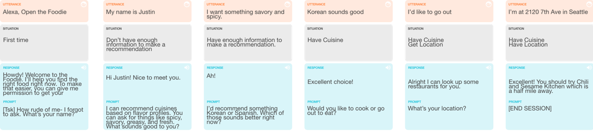
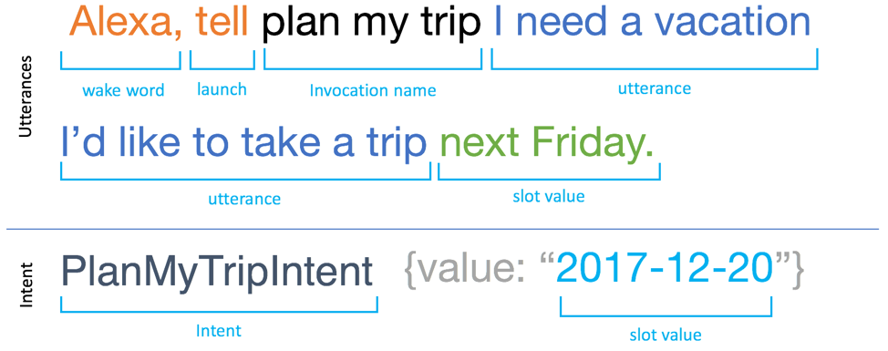

# Design Alexa Skill

## Plan and Design Your Skill

- Think about the value that your skill will provide to users. For more information, see [Determine the value proposition of your skill](https://developer.amazon.com/en-US/docs/alexa/alexa-design/which-skill.html#determine-the-value-proposition-of-your-skill).
- Consider how you might enhance the user experience. For example, you can [add in-skill purchasing](https://developer.amazon.com/en-US/docs/alexa/alexa-design/isp.html), [support screen interaction](https://developer.amazon.com/en-US/docs/alexa/alexa-design/apl.html), [change the audio](https://developer.amazon.com/en-US/docs/alexa/alexa-design/audio.html), [make your skill accessible to all](https://developer.amazon.com/en-US/docs/alexa/alexa-design/accessibility.html), and publish your skill to [additional markets](https://developer.amazon.com/en-US/docs/alexa/alexa-design/internationalization.html).
- Design a voice user interface. This maps out how users will interact with your skill. For guidance and best practices, see [Build Your Design Artifact](https://developer.amazon.com/en-US/docs/alexa/alexa-design/build-artifact.html).

## Decide What Kind of Skill to Build

Voice designers use storyboards to plan the progress of conversations over time. This shows the most likely, logical paths a customer can take. In Build Your Design Artifact, you learn how to construct storyboards, but first you need the core elements of each turn, which you lean to construct as a scripted dialog between the customer and Alexa. In the following sections, you’ll learn guidelines on how to create effective voice interactions, as well as some rules specific to Alexa to keep in mind as you design your skill.

## Decide what type of skill to build

[Document](https://developer.amazon.com/en-US/docs/alexa/alexa-design/which-skill.html#determine-the-value-proposition-of-your-skill)

- Custom Skill
- Smart Home Skill API
- Video Skill API
- Flash Briefing Skill API

## Design with four critical goals in mind

There are four core questions to the customer experience that you need to address:

- What’s the goal or purpose of your skill?
- How will customers invoke your skill?
- What can a customer do with your skill?
- What kinds of information do you need to collect from customers to personalize the experience?

## [Build Design Artifact](https://developer.amazon.com/en-US/docs/alexa/alexa-design/build-artifact.html)

_Storyboard_

- Happy Path
- Variation
- Test

## [Define the Interaction Model](https://developer.amazon.com/en-US/docs/alexa/alexa-design/build-artifact.html#define-the-interaction-model)

- [Use the built-in intents](https://developer.amazon.com/en-US/docs/alexa/custom-skills/standard-built-in-intents.html)
- [Extend built-in intents](https://developer.amazon.com/en-US/docs/alexa/custom-skills/implement-the-built-in-intents.html)

## Identify slots

Slots let you specify the variable parts of an utterance, allowing for more customization. Slots are commonly used in task and information-based skills. For example, dates and places are common slot types. You can choose slots from the built-in catalogs or create your own.

For example, if our utterance is: “I want to go snorkeling next Friday in Aruba.”

That can be broken down into: “I want to go [activity] [date] in [place].”

In this case, your slots would be activities, dates, and places. Many slots can be filled with the built-in library so you don’t have to add everything by hand. This ensures a consistent experience across Alexa.

## Design to Build Your Interaction Model

The interaction model refers to your collection of intents, sample utterances, and the dialog model:

- The requests your skill can handle are represented as intents.
- Intents can optionally have arguments called slots.
- Sample utterances map the intents to the words and phrases users can say to interact with your skill.
- A dialog model identifies information your skill requires and the prompts Alexa can use to collect and confirm that information in a conversation with the user.

There are two different ways to create these components:

- Use the developer console. This provides an updated console for the entire skill-building process, including the interaction model. You can also enter and edit the JSON for the interaction model in the JSON Editor. This is useful for pasting in the JSON provided in sample projects.
- Create the JSON for the interaction model and create or update your skill with the Skill Management API or the ASK Command Line Interface.
